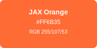
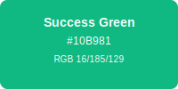
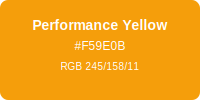
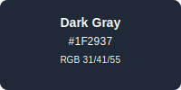

# JAX-sklearn Brand Guidelines

This section contains information around JAX-sklearn's brand standards and the use of JAX-sklearn assets. The purpose of these guidelines are to ensure the JAX-sklearn logo remains consistent and recognizable across all uses and communications. These guidelines also provide a common language for referring to the logos and their components.

File types:
- `PNG` is a higher-quality compression format; size of file is generally larger
- `ICO` file format refers to an image file format that contains small size computer icon images  
- `SVG` Scalable Vector Graphics (SVG) are an XML-based markup language for describing two-dimensional based vector graphics. They can be created and edited with any text editor or with drawing software.

[Brand Name](#brand-name) | [Color Palette](#color-palette) | [Typography](#typography) | [Logos](#logos) | [Usage Guidelines](#usage-guidelines)

---
<br>

## Brand Name
The official name of the package is __JAX-sklearn__. 

**Correct Usage:**
- JAX-sklearn (preferred)
- jax-sklearn (acceptable in code/URLs)

**Incorrect Usage:**
- ❌ Jax-sklearn
- ❌ JAX-Sklearn  
- ❌ JAXSklearn
- ❌ jax_sklearn (except in Python imports)

## Color Palette

### Primary Colors

 
**JAX Orange** `RGB 255/107/53 | HEX #FF6B35` | [Color Info](https://www.color-hex.com/color/ff6b35)
*Used for JAX branding, acceleration indicators, and performance highlights*


**sklearn Blue** `RGB 59/130/246 | HEX #3B82F6` | [Color Info](https://www.color-hex.com/color/3b82f6)
*Used for sklearn branding, stability indicators, and API compatibility*

### Secondary Colors


**Success Green** `RGB 16/185/129 | HEX #10B981` | [Color Info](https://www.color-hex.com/color/10b981)
*Used for success states, performance gains, and positive indicators*


**Performance Yellow** `RGB 245/158/11 | HEX #F59E0B` | [Color Info](https://www.color-hex.com/color/f59e0b)
*Used for warnings, performance metrics, and attention-grabbing elements*


**Dark Gray** `RGB 31/41/55 | HEX #1F2937` | [Color Info](https://www.color-hex.com/color/1f2937)
*Used for dark themes, professional contexts, and high contrast*

### Color Usage Guidelines

**Primary Combinations:**
- JAX Orange (#FF6B35) + sklearn Blue (#3B82F6) - Main brand combination
- Success Green (#10B981) for performance indicators
- Performance Yellow (#F59E0B) for speed/efficiency badges

**Accessibility:**
- All color combinations meet WCAG 2.1 AA contrast requirements
- Dark theme variants available for all colors
- Colorblind-friendly palette tested

## Typography

### Logo Typography
- **"JAX"**: Arial Black / Helvetica Bold (weight: 900)
- **"sklearn"**: Arial / Helvetica (weight: 600)
- **Tagline**: Arial / Helvetica (weight: 400)

### Brand Typography Hierarchy
1. **Headers**: Arial Black, Helvetica Bold
2. **Subheaders**: Arial Bold, Helvetica Bold  
3. **Body Text**: Arial, Helvetica, sans-serif
4. **Code**: Consolas, Monaco, 'Courier New', monospace

## Logos

You may highlight or reference your work with JAX-sklearn by using one of the logos provided below. Any use must abide by the Logo Integrity Standards defined below.

### Main Logos

| Preview | Description |
| ------- | ----------- |
|  | **Main Logo** <br> File type: SVG <br> Dimensions: 400×120px <br> Use: Primary brand representation <br> File: [jax-sklearn-logo.svg](jax-sklearn-logo.svg) |
|  | **Horizontal Logo** <br> File type: SVG <br> Dimensions: 600×80px <br> Use: Wide layouts, headers <br> File: [jax-sklearn-logo-horizontal.svg](jax-sklearn-logo-horizontal.svg) |
|  | **Icon Only** <br> File type: SVG <br> Dimensions: 80×80px <br> Use: Social media, app icons <br> File: [jax-sklearn-logo-notext.svg](jax-sklearn-logo-notext.svg) |

### Theme Variations

| Preview | Description |
| ------- | ----------- |
|  | **Dark Theme Logo** <br> File type: SVG <br> Dimensions: 400×120px <br> Use: Dark backgrounds, night mode <br> File: [jax-sklearn-logo-dark.svg](jax-sklearn-logo-dark.svg) |
|  | **High Resolution** <br> File type: SVG (for PNG conversion) <br> Dimensions: 1280×384px <br> Use: Print, large displays <br> File: [jax-sklearn-logo-1280.svg](jax-sklearn-logo-1280.svg) |

### Favicon

| Preview | Description |
| ------- | ----------- |
|  | **Favicon Source** <br> File type: SVG <br> Dimensions: 32×32px <br> Use: Browser tabs, bookmarks <br> File: [favicon-source.svg](favicon-source.svg) |

## Usage Guidelines

### Logo Integrity Standards

#### ✅ Correct Usage
- **Minimum Size**: 50px wide for main logo, 24px for icon-only
- **Proportional Scaling**: Always maintain aspect ratio
- **Clear Space**: Use minimum clear space equal to the height of the lightning bolt
- **Approved Colors**: Only use official brand colors
- **Proper Backgrounds**: Ensure sufficient contrast

#### ❌ Incorrect Usage
- **Do Not** stretch, compress, or distort the logo
- **Do Not** change colors outside the approved palette
- **Do Not** modify typography or recreate the logo
- **Do Not** place on busy backgrounds without clear space
- **Do Not** use low-resolution versions for print

### Clear Space Requirements


**Clear Space Rule**: Maintain minimum clear space around the logo equal to the height of the lightning bolt icon (X). This ensures the logo remains legible and impactful.

### Background Guidelines

#### Recommended Backgrounds
- **Light**: White (#FFFFFF), Light Gray (#F9FAFB)
- **Dark**: Dark Gray (#1F2937), Black (#000000)
- **Colored**: Use dark theme logo on colored backgrounds

#### Background Contrast
- Light logo on dark backgrounds (contrast ratio ≥ 4.5:1)
- Dark logo on light backgrounds (contrast ratio ≥ 4.5:1)
- Avoid placing logo on busy patterns or images

### Size Guidelines

| Usage Context | Minimum Size | Recommended Size |
| ------------- | ------------ | ---------------- |
| **Website Headers** | 120px wide | 200-300px wide |
| **Social Media** | 80×80px | 400×400px |
| **Print Materials** | 1 inch wide | 2-3 inches wide |
| **Mobile Apps** | 24×24px | 48×48px |
| **Presentations** | 150px wide | 300-400px wide |

### File Format Guidelines

| Format | Use Case | When to Use |
| ------ | -------- | ----------- |
| **SVG** | Web, scalable graphics | Preferred for all digital uses |
| **PNG** | Web, presentations | When SVG not supported |
| **ICO** | Favicons, Windows icons | Browser tabs, desktop apps |
| **PDF** | Print materials | High-quality printing |

## Brand Applications

### Digital Applications
- **Websites**: Use SVG format for crisp scaling
- **Social Media**: Square icon version for profiles
- **Mobile Apps**: Follow platform-specific icon guidelines
- **Email Signatures**: Use PNG at 2x resolution for retina displays

### Print Applications  
- **Business Cards**: Minimum 0.5 inch wide
- **Letterhead**: Top left or center, 1-2 inches wide
- **Brochures**: Ensure 300 DPI for print quality
- **Merchandise**: Vector format required for embroidery/printing

### Co-branding Guidelines
When using JAX-sklearn logo with other brands:
- Maintain equal visual weight when possible
- Separate logos with adequate white space
- Use consistent alignment (left, center, or baseline)
- Respect both brands' guidelines

## Legal and Attribution

### Usage Rights
- ✅ **Permitted**: Educational use, research presentations, open source projects
- ✅ **Permitted**: Blog posts, articles, and documentation about JAX-sklearn
- ✅ **Permitted**: Conference presentations and academic papers
- ⚠️ **Requires Permission**: Commercial products, merchandise, or derivative works
- ❌ **Prohibited**: Implying endorsement without permission

### Attribution
When using JAX-sklearn logos:
```
JAX-sklearn logo used with permission. 
JAX-sklearn is an open source project: https://github.com/chenxingqiang/jax-sklearn
```

---

## Reference
- [JAX Brand Guidelines](https://github.com/google/jax)
- [scikit-learn Brand Guidelines](https://scikit-learn.org/stable/about.html#citing-scikit-learn)
- [Color Accessibility Guidelines](https://webaim.org/articles/contrast/)
- [WCAG 2.1 Contrast Requirements](https://www.w3.org/WAI/WCAG21/Understanding/contrast-minimum.html)

## Download All Assets
For the complete brand asset package, visit: [JAX-sklearn Brand Assets](https://github.com/chenxingqiang/jax-sklearn/tree/main/doc/logos)

---

**Questions about brand usage?** Open an issue at [JAX-sklearn GitHub Issues](https://github.com/chenxingqiang/jax-sklearn/issues)